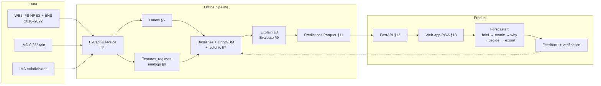
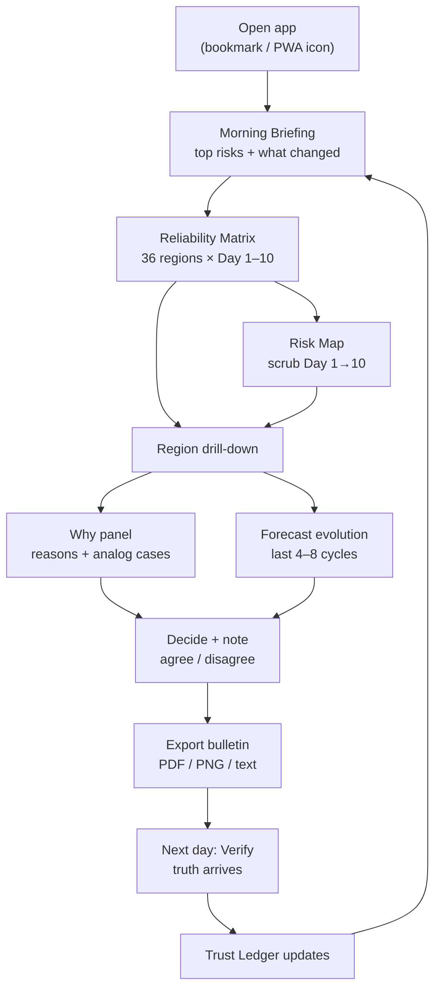

# PS 26079 — Implementation Guide

**Forecast-trust layer:** calibrated probability that a forecast will bust, per IMD subdivision (36) × Day 1–10, with reasons and analog cases.

Companion to the research document *PS 26079 — Complete Research & Solution Strategy*. This file is the build manual: repo layout, environment, every pipeline stage with working starter code, tests, and the week-by-week checklist.

> Conventions: `F` = forecast, `O` = observed (IMD), `r` = subdivision, `L` = lead day (1–10), `t` = initialisation time (UTC).
> Anything marked **VERIFY** was not confirmed during research — check it on day 1 before building on it.

---

## 0. Scope of the MVP (do not expand before it works end-to-end)

| Item | MVP value |
| --- | --- |
| Forecast judged | ECMWF IFS HRES (deterministic), from WeatherBench 2 |
| Ensemble | ECMWF IFS ENS, 50 members, WeatherBench 2 (1.5° file) |
| Period | 2018-01-01 → 2022-12-31, 00 and 12 UTC |
| Variable | 24-h rainfall |
| Truth | IMD 0.25° gridded daily rainfall |
| Regions | 36 IMD meteorological subdivisions |
| Leads | Day 1–10 (24-h windows ending 24…240 h) |
| Output | P(bust), confidence band, error q50/q90, top-3 reasons, 5 analog cases |
| Demo | Historical replay (offline, precomputed) |

Phase 2 (only after MVP passes the evaluation gate in §9): Tmax, MSLP/Z500, NEPS-G via TIGGE, near-real-time run.

---

## 0.1 End-to-end in one picture (data → model → forecaster)



| Stage | Input | Output | Section | Owner |
| --- | --- | --- | --- | --- |
| 1. Access tests | Public buckets, IMD site | Pass/fail + timings | §3 | Data |
| 2. Archive | WB2 Zarr, IMD grids, polygons | `table.parquet` (region × lead × init) | §4 | Data |
| 3. Labels | Table | bust, hi_bust, log_err | §5 | ML |
| 4. Features | Table + earlier cycles + analysis | ~25 features | §6 | ML |
| 5. Models | Features + labels | Baselines, LightGBM, calibrator | §7 | ML |
| 6. Explanations | Model + rows | Sentences + analog cards | §8 | ML |
| 7. Evaluation | Held-out years | BSS vs spread, reliability, gate decision | §9 | Eval |
| 8. Predictions | Frozen model | Parquet per init (replay store) | §11 | ML |
| 9. API | Parquet | JSON endpoints | §12 | Backend |
| 10. UI | API | Forecast Trust Console | §13 | Frontend |
| 11. Ship | All | Offline Docker + PWA, demo tour | §15, §18 | All |

---

## 0.2 Open-source building blocks (reuse, don't rewrite)

Rule for the team: **only write code for what is new in our project** (bust labels, analog *error* memory, feature joins, the product). Data access, verification metrics, EOFs, boosting, SHAP and maps come from maintained, peer-reviewed or widely used open-source projects below.

What this buys and what it doesn't: reused libraries remove whole classes of bugs (wrong Brier/reliability maths, broken GRIB parsing, bad area weighting) and make results credible to judges because the metric code is independently tested. They do **not** by themselves raise skill — skill comes from the data, bust definition and features. Anyone who says "using library X improves accuracy" should be asked for the ablation.

### A. Data access

| Repo | What it is | We use it for | Where in this plan | Status |
| --- | --- | --- | --- | --- |
| [google-research/weatherbench2](https://github.com/google-research/weatherbench2) + [data guide](https://weatherbench2.readthedocs.io/en/latest/data-guide.html) | Cloud Zarr archive of IFS HRES/ENS, ERA5, climatologies + evaluation code | **Primary forecast archive**; read `scripts/` and `weatherbench2/regions.py`, `metrics.py` for reference implementations (e.g. area weighting, SEEPS) | §3, §4.2 | Verified |
| [google-research/weatherbenchX](https://github.com/google-research/weatherbenchX) | Successor evaluation framework (modular, xarray) | Optional cross-check of our deterministic scores against the official pipeline | §9 | Verified |
| [iamsaswata/imdlib](https://github.com/iamsaswata/imdlib) | Download/read IMD gridded rain & temperature (archive + real-time) | **Ground truth** | §3, §4.3 | Verified |
| [IMD subdivision boundaries (gist)](https://gist.github.com/planemad/d347ad7485344fb0ba4b470721825427) → source `https://mausam.imd.gov.in/imd_latest/contents/district_shapefiles/sd_boundary.json` | IMD's own subdivision polygons (UTM 44N in source; gist reprojects to WGS84) | **Region masks** | §4.1 | Verified; licence unknown — cite IMD as source |
| [ecmwf/ecmwf-opendata](https://github.com/ecmwf/ecmwf-opendata) | Official client for ECMWF real-time open data (HRES + 50-member ENS) | Near-real-time feed (Phase 2) | §14 | Verified |
| [blaylockbk/Herbie](https://github.com/blaylockbk/Herbie) | Downloads GFS/GEFS/IFS GRIB2 from AWS/GCP/NOMADS/ECMWF, subsets by GRIB message, reads to xarray | GEFS operational + optional ECMWF open data; avoids downloading whole files | §14 | Verified |
| [ecmwf/ecmwf-api-client](https://github.com/ecmwf/ecmwf-api-client) README | States TIGGE has moved to the ECMWF Data Store (ECDS) | Tells us **not** to use old TIGGE scripts as-is | §14 | Verified |
| [AusClimateService/TIGGE](https://github.com/AusClimateService/TIGGE) | Batch TIGGE download scripts | Reference for request structure only (it warns access is changing) | §14 | Verified; may be outdated |

### B. Verification and evaluation

| Repo | What it is | We use it for | Status |
| --- | --- | --- | --- |
| [nci/scores](https://github.com/nci/scores) (Bureau of Meteorology; JOSS 2024) | 75+ reviewed verification metrics on xarray, incl. Brier score, **Flip-Flop Index**, quantile loss, ROC | Brier/BSS, pinball loss, and the **Flip-Flop Index** for the revision feature (Griffiths et al. 2019) — no hand-rolled version | Verified |
| [xarray-contrib/xskillscore](https://github.com/xarray-contrib/xskillscore) | Verification metrics incl. `reliability`, `roc`, `brier_score`, `rank_histogram`, resampling | Reliability diagrams, ROC, rank histograms of the ENS, resampling helpers | Verified |
| [Debasish-Mahapatra/nwpeval](https://github.com/Debasish-Mahapatra/nwpeval) (forked into the [IMD GitHub org](https://github.com/India-Meteorological-Department)) | 65 NWP metrics: POD, FAR, CSI, ETS, FSS, SEDS… | Categorical heavy-rain verification in the verification tab; speaks IMD's vocabulary | Verified |
| scikit-learn `calibration_curve`, `brier_score_loss`, `IsotonicRegression` | Standard ML calibration tools | Calibration + cross-check of the above | Standard |

### C. Modelling and analogs

| Repo | What it is | We use it for | Status |
| --- | --- | --- | --- |
| [sipposip/Predicting-weather-forecast-uncertainty-with-machine-learning](https://github.com/sipposip/Predicting-weather-forecast-uncertainty-with-machine-learning) | Code for Scher & Messori 2018 | **Closest prior work**: reuse their target construction ideas and compare our design choices; optional CNN ablation baseline | Verified (HPC-oriented; read, don't run as-is) |
| [Weiming-Hu/AnalogsEnsemble](https://github.com/Weiming-Hu/AnalogsEnsemble) + [PyAnEn](https://github.com/Weiming-Hu/PyAnEn) | Parallel Analog Ensemble (Delle Monache method), C++/R + Python tools | Reference for analog similarity metric, predictor weighting and time-window search; we reimplement the small piece we need in Python because we retrieve **errors**, not observations | Verified |
| [xarray-contrib/xeofs](https://github.com/xarray-contrib/xeofs) or [ajdawson/eofs](https://github.com/ajdawson/eofs) | EOF/PCA on xarray with latitude weighting and missing values | EOF pattern space for analogs; regime PCA | Verified |
| [microsoft/LightGBM](https://github.com/microsoft/LightGBM) | Gradient boosting with monotone constraints | Main classifier + quantile heads | Standard |
| [shap/shap](https://github.com/shap/shap) | TreeSHAP | Per-prediction attributions → sentences | Standard |
| [regionmask/regionmask](https://github.com/regionmask/regionmask) | Fractional polygon masks on lat/lon grids | Area-weighted subdivision means | Standard |
| [facebookresearch/faiss](https://github.com/facebookresearch/faiss) | Fast nearest-neighbour search | Only if scikit-learn `BallTree` is too slow | Optional |

### D. Front end

| Repo | Use |
| --- | --- |
| [maplibre/maplibre-gl-js](https://github.com/maplibre/maplibre-gl-js) | Free vector map for the choropleth |
| [apache/echarts](https://github.com/apache/echarts) | Matrix heatmap, line + band charts, reliability diagrams, animation |
| [shadcn-ui/ui](https://github.com/shadcn-ui/ui) | Accessible UI components (Radix-based) |
| [vite-pwa/vite-plugin-pwa](https://github.com/vite-pwa/vite-plugin-pwa) | Installable, offline-capable web-app |
| [kamranahmedse/driver.js](https://github.com/kamranahmedse/driver.js) | Guided demo tour |

### E. How to study the repos in week 1 (2–3 hours each, one owner per row)

| Owner | Read | Deliverable |
| --- | --- | --- |
| Data 1 | WB2 data guide + `weatherbench2/regions.py`, `metrics.py` | Note on units, accumulation conventions, lat ordering, area weighting |
| Data 2 | imdlib docs + IMD subdivision JSON | Working masks + one year of subdivision rain |
| ML | Scher & Messori repo + paper; PyAnEn docs | 1-page note: what we copy, what we change and why |
| Evaluation | `scores` tutorials (Brier, Flip-Flop Index, ROC) + xskillscore `reliability` | Evaluation notebook skeleton that runs on dummy data |
| Backend/Frontend | ecmwf-opendata README, Herbie gallery, MapLibre choropleth example | Plan for NRT fetch + map component |

---

## 1. Repository layout

```
ps26079/
├── README.md
├── IMPLEMENTATION.md            ← this file
├── pyproject.toml
├── .env.example
├── configs/
│   ├── base.yaml                ← paths, years, leads, thresholds
│   └── regions/                 ← subdivision polygons (GeoJSON)
├── data/                        ← git-ignored
│   ├── raw/                     ← IMD .grd / .nc, masks
│   ├── interim/                 ← per-year extracted parquet
│   └── processed/               ← training table, predictions
├── src/bustrisk/
│   ├── __init__.py
│   ├── config.py
│   ├── regions.py               ← masks + area-weighted means
│   ├── extract_wb2.py           ← forecast extraction from WB2 Zarr
│   ├── truth_imd.py             ← IMD rainfall → subdivision means
│   ├── labels.py                ← log-error, bust, high-impact bust
│   ├── features.py              ← spread anomaly, state, revision
│   ├── regimes.py               ← k-means + rule detectors
│   ├── analogs.py               ← EOF + kNN analog error memory
│   ├── baselines.py             ← B0–B4
│   ├── model.py                 ← LightGBM + isotonic
│   ├── explain.py               ← SHAP → sentences
│   ├── evaluate.py              ← Brier, BSS, reliability, bootstrap
│   ├── predict.py               ← inference for one init
│   └── nrt.py                   ← Phase 2 daily job
├── api/
│   └── main.py                  ← FastAPI
├── web/                         ← React + TS + Vite + MapLibre + ECharts PWA (full tree in §13.9)
├── notebooks/
│   ├── 00_access_tests.ipynb
│   ├── 10_eda_errors.ipynb
│   └── 20_results.ipynb
├── tests/
│   ├── test_leakage.py
│   ├── test_labels.py
│   └── test_regions.py
└── docker-compose.yml
```

---

## 2. Environment

```bash
python -m venv .venv && source .venv/bin/activate
pip install "xarray[complete]" zarr gcsfs dask netCDF4 cfgrib eccodes \
            imdlib geopandas regionmask shapely pyarrow duckdb \
            scikit-learn lightgbm shap pyyaml tqdm \
            scores xskillscore nwpeval xeofs \
            fastapi uvicorn pydantic matplotlib
pip install git+https://github.com/google-research/weatherbench2.git   # reference code + helpers
# Phase 2 only:
pip install ecmwf-opendata herbie-data
# TIGGE: ECMWF Data Store (ECDS) client — VERIFY current package name on the ECDS site
```

Hardware: laptop with 16 GB RAM for everything except extraction. Run extraction (§4) on Google Colab or a small GCP VM so reads from the public `gs://weatherbench2` bucket are fast.

`configs/base.yaml`:

```yaml
years: {train: [2018, 2019, 2020], calib: [2021], test: [2022], oos: [2024, 2025, 2026]}
cycles: ["00", "12"]
leads_days: [1, 2, 3, 4, 5, 6, 7, 8, 9, 10]
bbox: {lat: [0, 40], lon: [50, 100]}
bust: {quantile: 0.90, floor_mm: 5.0, doy_window: 15}
high_impact: {heavy_mm: 64.5, obs_frac: 0.10, fcst_frac_low: 0.02}
analogs: {k: 20, n_eofs: 10, doy_window: 30, exclude_same_year_days: 15}
paths:
  wb2_hres: gs://weatherbench2/datasets/hres/2016-2022-0012-1440x721.zarr
  wb2_ens:  gs://weatherbench2/datasets/ifs_ens/2018-2022-240x121_equiangular_with_poles_conservative.zarr
  wb2_t0:   gs://weatherbench2/datasets/hres_t0/2016-2022-6h-1440x721.zarr
  imd_dir:  data/raw/imd
  regions:  configs/regions/imd_subdivisions.geojson
```

---

## 3. Week-1 access tests (do these before writing anything else)

Notebook `00_access_tests.ipynb`. Each test must print a pass/fail and a measured size/time.

```python
import time, xarray as xr
SO = {"token": "anon"}

# T1: WB2 HRES opens, one chunk read over India
t0 = time.time()
hres = xr.open_zarr("gs://weatherbench2/datasets/hres/2016-2022-0012-1440x721.zarr", storage_options=SO)
x = hres["total_precipitation_24hr"].sel(time="2020-07-15T00", prediction_timedelta="5D")
x = x.sortby("latitude").sel(latitude=slice(0, 40), longitude=slice(50, 100)).load()
print("T1 HRES ok", x.shape, f"{time.time()-t0:.1f}s")

# T2: WB2 ENS (1.5°) opens, 50 members present
ens = xr.open_zarr("gs://weatherbench2/datasets/ifs_ens/2018-2022-240x121_equiangular_with_poles_conservative.zarr", storage_options=SO)
e = ens["total_precipitation_24hr"].sel(time="2020-07-15T00", prediction_timedelta="5D").load()
print("T2 ENS ok", dict(e.sizes))

# T3: IMD rainfall one year
import imdlib as imd
imd.get_data("rain", 2020, 2020, fn_format="yearwise", file_dir="data/raw/imd")
r = imd.open_data("rain", 2020, 2020, "yearwise", "data/raw/imd").get_xarray()
print("T3 IMD ok", dict(r.sizes))
```

| Test | Pass criterion | If it fails |
| --- | --- | --- |
| T1 HRES | array loads, values in metres | check variable names with `list(hres.data_vars)` |
| T2 ENS | `number` = 50 | use `64x32` file for a quick check, then debug |
| T3 IMD | 365/366 days, 129×135 grid | download manually from imdpune.gov.in |
| T4 Subdivisions | 36 polygons load from IMD `sd_boundary.json` (via the gist) | fallback 2°×2° boxes (§4.1) |
| T5 TIGGE NCMRWF | one day of NCMRWF precip retrieved | Phase 2 only; record what params/grid exist |
| T6 Timing | measure seconds per (init, lead) chunk | recompute §4 time budget from this number |

Record results in `notebooks/00_access_tests.ipynb` and paste the timing into the team channel. Everything downstream is sized from T6.

---

## 4. Build the forecast–truth archive

### 4.1 Regions and masks — `regions.py`

```python
import geopandas as gpd, regionmask, numpy as np, xarray as xr

IMD_SD_URL = "https://mausam.imd.gov.in/imd_latest/contents/district_shapefiles/sd_boundary.json"
# Source file is in UTM 44N (EPSG:32644) per the gist notes; the gist also offers a WGS84 GeoJSON.

def load_regions(path_or_url=IMD_SD_URL):
    gdf = gpd.read_file(path_or_url)
    if gdf.crs is None:
        gdf = gdf.set_crs(32644)            # VERIFY against the file's own metadata
    gdf = gdf.to_crs(4326)
    gdf = gdf.rename(columns={gdf.columns[0]: "name"})   # adjust to the real name column
    gdf = gdf.dissolve("name").reset_index()             # one polygon per subdivision
    gdf["rid"] = range(len(gdf))
    assert len(gdf) in (36, 37), f"expected ~36 subdivisions, got {len(gdf)}"
    gdf.to_file("configs/regions/imd_subdivisions.geojson", driver="GeoJSON")  # cache locally
    return gdf

def fallback_boxes(lat=(6, 38), lon=(66, 100), step=2.0):
    import shapely.geometry as sg
    rows = [dict(name=f"box_{a}_{b}", geometry=sg.box(b, a, b+step, a+step))
            for a in np.arange(*lat, step) for b in np.arange(*lon, step)]
    g = gpd.GeoDataFrame(rows, crs=4326); g["rid"] = range(len(g)); return g

def region_weights(gdf, lat, lon):
    """3-D fractional mask (region, lat, lon) × cos(lat) area weights."""
    m = regionmask.from_geopandas(gdf, names="name", numbers="rid")
    frac = m.mask_3D_frac_approx(xr.Dataset(coords={"lat": lat, "lon": lon}))
    w = frac * np.cos(np.deg2rad(frac.lat))
    return w / w.sum(("lat", "lon"))

def region_mean(da, w):
    da = da.rename({"latitude": "lat", "longitude": "lon"}) if "latitude" in da.dims else da
    return (da * w).sum(("lat", "lon"))
```

Build **three** weight arrays once and cache them: IMD 0.25° grid, WB2 0.25° grid, WB2 1.5° grid. For rainfall, also restrict weights to IMD land cells (IMD values are missing over sea) so forecast and truth average over the same area.

### 4.2 Forecast extraction — `extract_wb2.py`

Run per year, in parallel, on Colab/VM. Output: one Parquet per year with rows `(model, init, lead, rid, ...)`.

```python
import xarray as xr, pandas as pd, numpy as np
SO = {"token": "anon"}
LEADS = [pd.Timedelta(days=d) for d in range(1, 11)]

def extract_year(year, cfg, w_hres, w_ens):
    hres = xr.open_zarr(cfg["paths"]["wb2_hres"], storage_options=SO)
    ens  = xr.open_zarr(cfg["paths"]["wb2_ens"],  storage_options=SO)
    sl = dict(time=slice(f"{year}-01-01", f"{year}-12-31T12"), prediction_timedelta=LEADS)

    # Deterministic forecast being judged (mm)
    f = hres["total_precipitation_24hr"].sel(**sl).sortby("latitude") * 1000
    f = region_mean(f.sel(latitude=slice(0, 40), longitude=slice(50, 100)), w_hres)

    # Ensemble statistics at 1.5° (mm)
    tp = ens["total_precipitation_24hr"].sel(**sl).sortby("latitude") * 1000
    tp = tp.sel(latitude=slice(0, 40), longitude=slice(50, 100))
    tp_r = region_mean(tp, w_ens)                             # (time, lead, number, region)
    stats = xr.Dataset({
        "ens_mean":   tp_r.mean("number"),
        "ens_spread": tp_r.std("number"),
        "ens_log_spread": np.log1p(tp_r).std("number"),
        "p_heavy_member": (tp_r >= 64.5).mean("number"),      # area-mean ≥ 64.5 is strict; see note
        "ens_q10": tp_r.quantile(0.1, "number"),
        "ens_q90": tp_r.quantile(0.9, "number"),
    })
    # State variables from HRES (box means around each region: see features.py)
    df = xr.merge([f.rename("f_rain"), stats]).to_dataframe().reset_index()
    df = df.rename(columns={"time": "init", "prediction_timedelta": "lead", "region": "rid"})
    df["lead"] = df["lead"].dt.days
    df["valid_date"] = (df["init"] + pd.to_timedelta(df["lead"], "D")).dt.floor("D")
    df.to_parquet(f"data/interim/fcst_{year}.parquet")
```

Notes:
- Process month by month inside `extract_year` with `.load()` per month to keep memory flat; write each month, then concatenate.
- `p_heavy_member` on area means is too strict for heavy rain; in Phase 1b compute the **gridpoint** fraction ≥ 64.5 mm per member first, then average. Needed for the high-impact label on the forecast side (`f_heavy_frac` from HRES at 0.25°).
- Also extract, for the state/regime features: `total_column_water_vapour` if present (**VERIFY** in HRES; otherwise use `specific_humidity` 850), `u/v_component_of_wind` 850, `mean_sea_level_pressure`, `geopotential` 500 — as box statistics (mean, min, max) over a 5°×5° box around each region's centroid.
- Keep 00 and 12 UTC: the 12-hour-earlier cycle is needed for the revision feature.

### 4.3 Truth — `truth_imd.py`

```python
import imdlib as imd, xarray as xr, pandas as pd

def imd_region_rain(years, cfg, w_imd):
    out = []
    for y in years:
        da = imd.open_data("rain", y, y, "yearwise", cfg["paths"]["imd_dir"]).get_xarray()["rain"]
        da = da.where(da >= 0)                      # IMD uses -999 for missing
        o = region_mean(da, w_imd)                  # mm/day
        heavy = region_mean((da >= 64.5).astype(float).where(da.notnull()), w_imd)
        df = xr.merge([o.rename("o_rain"), heavy.rename("o_heavy_frac")]).to_dataframe().reset_index()
        out.append(df)
    df = pd.concat(out).rename(columns={"time": "valid_date", "region": "rid"})
    return df
```

**Time alignment.** IMD's rain day for date D ends 03 UTC on D (08:30 IST). WB2 `total_precipitation_24hr` at lead L is the 24 h ending at init + L. With 00 UTC inits, the forecast window ends 00 UTC — 3 h off. Implement a `valid_date` mapping function in one place, unit-test it (`tests/test_labels.py`), and document the 3-h offset. Run a sensitivity check using 12 UTC inits in Phase 2.

### 4.4 Join

```python
fc = pd.concat(pd.read_parquet(f"data/interim/fcst_{y}.parquet") for y in range(2018, 2023))
truth = imd_region_rain(range(2018, 2023), cfg, w_imd)
table = fc.merge(truth, on=["valid_date", "rid"], how="inner")
table.to_parquet("data/processed/table.parquet")
```

Sanity plot before moving on: for 3 subdivisions, time series of `f_rain` vs `o_rain` at Day 1 for JJAS 2020. If they do not visibly track, the alignment or units are wrong.

---

## 5. Labels — `labels.py`

```python
import numpy as np, pandas as pd

def add_log_error(df):
    df["log_err"] = np.abs(np.log1p(df.f_rain) - np.log1p(df.o_rain))
    df["abs_err_mm"] = np.abs(df.f_rain - df.o_rain)
    df["doy"] = df.valid_date.dt.dayofyear
    return df

def fit_thresholds(train, q=0.90, win=15):
    """Q90 of log_err per (rid, lead, doy) using a ±win-day circular window. Train years only."""
    rows = []
    for (rid, lead), g in train.groupby(["rid", "lead"]):
        d = g.doy.values; e = g.log_err.values
        for doy in range(1, 367):
            dist = np.minimum(np.abs(d - doy), 366 - np.abs(d - doy))
            rows.append((rid, lead, doy, np.quantile(e[dist <= win], q)))
    return pd.DataFrame(rows, columns=["rid", "lead", "doy", "thr"])

def add_bust(df, thr, floor_mm=5.0):
    df = df.merge(thr, on=["rid", "lead", "doy"], how="left")
    df["bust"] = ((df.log_err > df.thr) & (df.abs_err_mm >= floor_mm)).astype(int)
    return df

def add_high_impact(df, obs_frac=0.10, low=0.02):
    miss = (df.o_heavy_frac >= obs_frac) & (df.f_heavy_frac < low)
    fa   = (df.f_heavy_frac >= obs_frac) & (df.o_heavy_frac < low)
    df["hi_bust"] = (miss | fa).astype(int)
    df["hi_type"] = np.select([miss, fa], ["miss", "false_alarm"], "none")
    return df
```

Rules:
- `fit_thresholds` receives **only training-year rows**. Save the threshold table with the model version.
- Expected base rate of `bust` ≈ 8–10% (floor removes some). Print it per lead and per month; if any cell is far from that, investigate before training.

---

## 6. Features — `features.py`, `regimes.py`, `analogs.py`

Every feature function takes the table and returns new columns; each must only use rows with `init <= current init`.

### 6.1 Ensemble

```python
def add_ensemble_features(df, clim):
    # clim: mean ens_spread per (rid, lead, month) from TRAIN years
    df = df.merge(clim, on=["rid", "lead", "month"], how="left")
    df["spread_anom"]   = df.ens_spread / (df.spread_clim + 0.1)
    df["hres_minus_em"] = np.abs(df.f_rain - df.ens_mean)
    df["ens_iqr_rel"]   = (df.ens_q90 - df.ens_q10) / (df.ens_mean + 1)
    return df
```

### 6.2 Forecast state
Forecast rain anomaly vs model climate of the same lead and month (from train years), TCWV / q850, U850 speed and vorticity, MSLP minimum and gradient in the region's box. Use anomalies (value − train-climatology) so seasons are comparable.

### 6.3 Revision (cycle-to-cycle)

```python
def add_revision(df):
    key = ["rid", "valid_date"]
    df = df.sort_values(key + ["init"])
    g = df.groupby(key)
    df["prev12_f"] = g.f_rain.shift(1)          # same valid date, previous cycle (12 h earlier)
    df["prev24_f"] = g.f_rain.shift(2)
    df["rev12"] = np.abs(np.log1p(df.f_rain) - np.log1p(df.prev12_f))
    df["rev24"] = np.abs(np.log1p(df.f_rain) - np.log1p(df.prev24_f))
    return df
```

**Flip-Flop Index — reuse, don't rewrite.** `scores` implements the Griffiths et al. (2019) Flip-Flop Index (`scores.continuous.flip_flop_index`; check the exact signature in the [scores API docs](https://scores.readthedocs.io)). Build an xarray of the last 4 cycles' forecasts for each `(rid, valid_date)`, ordered oldest → newest, and pass it along the lead/issue dimension:

```python
import xarray as xr, scores

def add_flipflop(df, n_cycles=4):
    # rows sorted by init within (rid, valid_date); keep the latest n cycles up to the current init
    def ffi(g):
        out = np.full(len(g), np.nan)
        vals = g.f_rain.to_numpy()
        for i in range(n_cycles - 1, len(g)):
            seq = xr.DataArray(vals[i - n_cycles + 1:i + 1], dims="lead_day")
            out[i] = float(scores.continuous.flip_flop_index(seq, sampling_dim="lead_day"))
        return pd.Series(out, index=g.index)
    df["ffi4"] = df.groupby(["rid", "valid_date"], group_keys=False).apply(ffi)
    return df
```

Every window ends at the current row, so only earlier cycles are used.

`shift` within `(rid, valid_date)` sorted by `init` only ever looks at **earlier** cycles, so no leakage. Assert this in `tests/test_leakage.py` (§10).

### 6.4 Regimes — `regimes.py`

1. From `hres_t0` at each init, take Z500, U850, V850 and humidity over 0–40°N, 50–100°E, coarsened to 2.5°.
2. Standardise with train-year statistics, PCA → 10 components, k-means with k = 6–8 (fit on train years only).
3. Name clusters by inspecting composites (e.g. active monsoon, break, NE monsoon, winter WD, pre-monsoon heat). Keep the names in `configs/regimes.yaml`.
4. Rule detectors (booleans):
   - `low_bay` / `low_arabian`: MSLP minimum in Bay (10–25°N, 80–95°E) / Arabian Sea box at least 4 hPa below the box mean and 850 hPa relative vorticity above a threshold (tune on known depressions).
   - `wd_trough`: Z500 anomaly below −1 σ over 30–40°N, 60–80°E.
   - `heat`: forecast 2 m T anomaly > +4.5 °C over the region (IMD-style departure; tune).

### 6.5 Analog error memory — `analogs.py`

```python
import numpy as np
from sklearn.decomposition import PCA
from sklearn.neighbors import BallTree

class AnalogMemory:
    """Per (rid, lead): EOF space of forecast patterns + index of TRAIN-year forecasts and their errors."""
    def __init__(self, k=20, n_eofs=10, doy_window=30):
        self.k, self.n, self.win = k, n_eofs, doy_window
        self.store = {}

    def fit(self, X_train, meta_train):
        # X_train: dict[(rid, lead)] -> array (n_cases, n_features_pattern)
        # meta_train: dict[(rid, lead)] -> DataFrame[init, doy, year, log_err, bust]
        for key, X in X_train.items():
            pca = PCA(self.n).fit(X)
            Z = pca.transform(X)
            self.store[key] = dict(pca=pca, Z=Z, tree=BallTree(Z), meta=meta_train[key].reset_index(drop=True))
        return self

    def query(self, key, x, doy, year, exclude_days=15):
        s = self.store[key]
        z = s["pca"].transform(x[None])[0]
        d, i = s["tree"].query(z[None], k=min(10 * self.k, len(s["Z"])))
        d, i = d[0], i[0]
        m = s["meta"].iloc[i].copy(); m["dist"] = d
        doy_ok = np.minimum(abs(m.doy - doy), 366 - abs(m.doy - doy)) <= self.win
        m = m[doy_ok & (m.year != year)].head(self.k)        # same-year cases never used
        typical = np.median(s["tree"].query(s["Z"][:200], k=2)[0][:, 1])
        return dict(
            an_err_mean=m.log_err.mean(), an_err_q90=m.log_err.quantile(0.9),
            an_bust_rate=m.bust.mean(), an_novelty=m.dist.iloc[0] / typical,
            an_cases=m[["init", "log_err", "bust"]].head(5).to_dict("records"),
        )
```

Pattern vector for `(rid, lead)`: HRES rain, q850/TCWV, U850, MSLP on a 1.5° grid inside a 10°×10° box centred on the region, flattened and standardised. Build `X_train` from train years only.

**Latitude-weighted EOFs via `xeofs`** (swap in for sklearn `PCA` once the pipeline runs; same interface idea):

```python
import xeofs as xe
model = xe.single.EOF(n_modes=10, use_coslat=True)   # VERIFY class path for your installed xeofs version
model.fit(box_fields_train, dim="init")               # xarray (init, lat, lon[, var]) — train years only
Z_train = model.scores()                              # (mode, init) → index these in BallTree
Z_new   = model.transform(box_field_today)            # project today's forecast
```

**What we take from PyAnEn / AnalogsEnsemble** (read the docs, don't install the C++ build): per-predictor standardisation and weights, a search window restricted in time of year, and the number of analogs as a tuned parameter. What we change: the analog "member" we collect is the **past forecast's error**, not the past observation. For **training-set** analog features, query with `year != own year` (leave-one-year-out) so a training row never sees its own error.

---

## 7. Baselines and model — `baselines.py`, `model.py`

```python
import lightgbm as lgb
from sklearn.linear_model import LogisticRegression
from sklearn.isotonic import IsotonicRegression

FEATURES = ["lead", "rid", "doy_sin", "doy_cos",
            "spread_anom", "ens_log_spread", "hres_minus_em", "ens_iqr_rel", "p_heavy_member",
            "f_rain_anom", "q850_anom", "u850_anom", "mslp_min_anom",
            "rev12", "rev24", "ffi4",
            "regime", "low_bay", "low_arabian", "wd_trough", "heat",
            "an_err_mean", "an_err_q90", "an_bust_rate", "an_novelty"]

def b0_climatology(train, test):      # bust rate per rid × lead × month
    r = train.groupby(["rid", "lead", "month"]).bust.mean().rename("p")
    return test.join(r, on=["rid", "lead", "month"])["p"].fillna(train.bust.mean())

def b2_spread(train, test):
    X = ["spread_anom", "lead"]
    m = LogisticRegression(max_iter=1000).fit(train[X], train.bust)
    return m.predict_proba(test[X])[:, 1]

def fit_main(train, valid):
    mono = [1 if f == "spread_anom" else 0 for f in FEATURES]
    clf = lgb.LGBMClassifier(n_estimators=2000, learning_rate=0.03, num_leaves=31,
                             min_child_samples=200, subsample=0.8, subsample_freq=1,
                             colsample_bytree=0.8, monotone_constraints=mono)
    clf.fit(train[FEATURES], train.bust, eval_set=[(valid[FEATURES], valid.bust)],
            categorical_feature=["rid", "regime"],
            callbacks=[lgb.early_stopping(100, verbose=False)])
    return clf

def calibrate(clf, calib):
    raw = clf.predict_proba(calib[FEATURES])[:, 1]
    return IsotonicRegression(out_of_bounds="clip").fit(raw, calib.bust)
```

- `valid` for early stopping = last 3 months of the train years, **not** the calibration year.
- Error head: `lgb.LGBMRegressor(objective="quantile", alpha=0.5)` and `alpha=0.9` on `log_err`, same features.
- Confidence bands from calibrated P: High < 0.05, Normal 0.05–0.15, Reduced 0.15–0.30, Low > 0.30 (re-tune on calibration year only).
- Save: model, calibrator, threshold table, climatologies, PCA/kNN store, regime model, feature list, git hash → `models/<version>/`.

---

## 8. Explanations — `explain.py`

```python
import shap
GROUPS = {
  "spread":   ["spread_anom", "ens_log_spread", "hres_minus_em", "ens_iqr_rel", "p_heavy_member"],
  "analogs":  ["an_err_mean", "an_err_q90", "an_bust_rate"],
  "novelty":  ["an_novelty"],
  "revision": ["rev12", "rev24", "ffi4"],
  "regime":   ["regime", "low_bay", "low_arabian", "wd_trough", "heat"],
  "state":    ["f_rain_anom", "q850_anom", "u850_anom", "mslp_min_anom"],
}
TEMPLATES = {
  "spread":   "Members disagree more than usual for Day {lead} in {month} ({spread_anom:.1f}× normal spread).",
  "analogs":  "{n_bust} of the {n} most similar past forecasts had large errors (e.g. {ex_date}).",
  "novelty":  "Today's pattern is unlike past cases; the tool has little history to rely on.",
  "revision": "The forecast for this day changed noticeably since the previous cycle.",
  "regime":   "{regime_sentence}",
  "state":    "Forecast rainfall is far from normal for this region and season.",
}

def explain_rows(clf, rows):
    sv = shap.TreeExplainer(clf).shap_values(rows[FEATURES])
    sv = sv[1] if isinstance(sv, list) else sv
    out = []
    for i in range(len(rows)):
        contrib = {g: sv[i, [FEATURES.index(f) for f in fs]].sum() for g, fs in GROUPS.items()}
        top = [g for g, v in sorted(contrib.items(), key=lambda kv: -kv[1]) if v > 0][:3]
        out.append(top)
    return out
```

Only groups that **increase** risk become sentences. Fill templates from the row's own values and analog cases. Never generate free text.

---

## 9. Evaluation — `evaluate.py`

```python
import numpy as np
def brier(p, y): return np.mean((p - y) ** 2)
def bss(p, p_ref, y): return 1 - brier(p, y) / brier(p_ref, y)

def week_block_bootstrap(df, p_col, ref_col, n=1000, seed=0):
    rng = np.random.default_rng(seed)
    df = df.assign(week=df.init.dt.to_period("W"))
    weeks = df.week.unique(); groups = dict(tuple(df.groupby("week")))
    vals = []
    for _ in range(n):
        s = pd.concat([groups[w] for w in rng.choice(weeks, len(weeks))])
        vals.append(bss(s[p_col], s[ref_col], s.bust))
    return np.percentile(vals, [2.5, 50, 97.5])
```

**Use reviewed library metrics, not hand-rolled ones.** The two functions above are only for the bootstrap loop (speed). Every number that goes on a slide is recomputed with `scores` / `xskillscore` / scikit-learn, and must match to 4 decimals:

```python
import xarray as xr, xskillscore as xs, scores
from sklearn.metrics import roc_auc_score, average_precision_score, brier_score_loss
from sklearn.calibration import calibration_curve

def library_report(df, p_col):
    y = xr.DataArray(df.bust.values, dims="case")
    p = xr.DataArray(df[p_col].values, dims="case")
    out = {
        "brier_scores": float(scores.probability.brier_score(p, y)),      # nci/scores
        "brier_sklearn": brier_score_loss(df.bust, df[p_col]),            # cross-check
        "roc_auc": roc_auc_score(df.bust, df[p_col]),
        "pr_auc": average_precision_score(df.bust, df[p_col]),
    }
    rel = xs.reliability(y.astype(bool), p, dim="case",
                         probability_bin_edges=np.linspace(0, 1, 11))     # xarray-contrib/xskillscore
    frac_pos, mean_pred = calibration_curve(df.bust, df[p_col], n_bins=10)  # cross-check
    return out, rel, (frac_pos, mean_pred)
```

For the verification tab's heavy-rain contingency scores (POD, FAR, CSI, ETS on forecast vs IMD ≥ 64.5 mm), use [`nwpeval`](https://github.com/Debasish-Mahapatra/nwpeval) standalone functions — same metric vocabulary IMD uses. Check function names in its README before coding.

Optional cross-check: run WeatherBench-X on the raw HRES rainfall over India to confirm our extraction reproduces the official deterministic scores' order of magnitude.

Report, for the test year and for leave-one-year-out:

| Output | Stratified by |
| --- | --- |
| BSS vs B0 and vs B2 with 95% CI | overall, lead, month, regime, subdivision group |
| Reliability diagram (10 bins) + ECE | overall, Day 1–3 / 4–7 / 8–10 |
| ROC-AUC, PR-AUC | bust and hi_bust separately |
| Hit rate at 20% false-alarm rate | lead |
| Pinball loss (q50, q90) | lead |
| Ablations A1–A7 | overall + lead |

**Evaluation gate for the MVP:** BSS vs B2 lower CI bound > 0 on the leave-one-year-out mean for at least Day 3–10. If not met, ship B2 + analog cards + calibration and present the negative result honestly.

Case studies: fix 5–8 events in week 1, write them in `configs/cases.yaml`, never change the list after seeing results.

---

## 10. Tests

`tests/test_leakage.py`

```python
def test_revision_uses_only_past(table):
    t = table.dropna(subset=["prev12_f"])
    prev = table.set_index(["rid", "valid_date", "init"]).f_rain
    for _, r in t.sample(500, random_state=0).iterrows():
        assert prev.loc[(r.rid, r.valid_date, r.init - pd.Timedelta(hours=12))] == r.prev12_f

def test_thresholds_train_only(thr_meta, cfg):
    assert set(thr_meta["years"]) <= set(cfg["years"]["train"])

def test_analogs_exclude_same_year(memory, sample_rows):
    for r in sample_rows:
        res = memory.query(r.key, r.x, r.doy, r.year)
        assert all(pd.Timestamp(c["init"]).year != r.year for c in res["an_cases"])

def test_shuffled_labels_have_no_skill(train, test):
    y = train.bust.sample(frac=1, random_state=0).values
    clf = fit_main(train.assign(bust=y), train.tail(5000))
    p = clf.predict_proba(test[FEATURES])[:, 1]
    assert bss(p, b0_climatology(train, test), test.bust) < 0.01
```

`tests/test_labels.py`: base rate per lead within 5–12%; `valid_date` mapping for a known init; no NaN labels where truth exists.
`tests/test_regions.py`: all 36 weights sum to 1; Kerala's centroid lies in Kerala's mask.

---

## 11. Batch prediction for replay — `predict.py`

```python
def predict_init(init, table, bundle):
    rows = table[table.init == init].copy()
    rows = add_all_features(rows, table[table.init <= init], bundle)   # history = only past cycles
    raw = bundle.clf.predict_proba(rows[FEATURES])[:, 1]
    rows["p_bust"] = bundle.iso.predict(raw)
    rows["confidence"] = pd.cut(rows.p_bust, [0, .05, .15, .30, 1], labels=["High", "Normal", "Reduced", "Low"])
    rows["err_q50"] = bundle.q50.predict(rows[FEATURES]); rows["err_q90"] = bundle.q90.predict(rows[FEATURES])
    rows["reasons"] = explain_rows(bundle.clf, rows)
    return rows
```

Precompute for every init in 2022 (and 2024–2026 when available) → `data/processed/predictions/model=<v>/year=<y>/*.parquet`. Replay reads only these files.

---

## 12. API — `api/main.py`

```python
from fastapi import FastAPI
import duckdb
app = FastAPI(title="PS26079 bust-risk")
con = duckdb.connect()
P = "data/processed/predictions/**/*.parquet"

@app.get("/cycles")
def cycles(frm: str, to: str):
    return con.execute(f"SELECT DISTINCT init FROM '{P}' WHERE init BETWEEN ? AND ? ORDER BY init", [frm, to]).df().to_dict("records")

@app.get("/matrix")
def matrix(init: str):
    q = f"SELECT rid, lead, p_bust, confidence, err_q90, hi_risk FROM '{P}' WHERE init = ?"
    return con.execute(q, [init]).df().to_dict("records")

@app.get("/explain/{rid}")
def explain(rid: int, init: str, lead: int):
    q = f"SELECT reasons, an_cases, regime, spread_anom, an_novelty FROM '{P}' WHERE rid=? AND init=? AND lead=?"
    return con.execute(q, [rid, init, lead]).df().to_dict("records")

# also: /region/{rid}, /revision/{rid}?valid=, /verify/{rid}?init=, /ledger, /health
```

Run: `uvicorn api.main:app --reload`.

---

## 13. Product & UI — "Forecast Trust Console" (`web/`)

The UI is where judges and forecasters meet the science, so it gets a full spec: platform decision, users, the journey from opening the app to acting on a forecast, every screen, the value-added features, the design system, the tech, and how it is tested.

### 13.1 Platform decision: website vs mobile app vs web-app

**Decision: a responsive single-page web-app, installable as a PWA (Progressive Web App). No native mobile app. No separate marketing website** — a short "About / Method" page lives inside the app.

| Criterion | Static website | Native mobile app (Android/iOS) | **Web-app (SPA + PWA)** |
| --- | --- | --- | --- |
| Primary user: duty forecaster at an NCMRWF/IMD desk with large monitors, maps, charts | Too limited — no interaction | Wrong device; small screen for a 36 × 10 matrix + map | **Fits: big screen, dense interactive views** |
| Interactive maps, heatmap, drill-down, replay | Hard | Possible but 2× build effort | **Native to the browser (MapLibre, charts)** |
| Offline SIH demo (no internet on stage) | Yes | Yes | **Yes — Docker on laptop + PWA cache** |
| One codebase for desktop, tablet, phone | Yes | No (or React Native — second stack) | **Yes (responsive)** |
| Installable, opens full-screen, works offline | No | Yes | **Yes (PWA install)** |
| Push alerts | No | Yes | Web Push (Phase 2, optional) |
| Deployment inside a government network | Easy | Needs app-store / MDM | **Easy: one container, a URL** |
| Team effort in 4 weeks | Low | High | **Medium** |
| What judges see | A page | A phone screen on a projector | **A full operational console on the projector** |

Why not native: the PS output is a region × lead matrix and maps — a desk-analysis task. Weather-centre forecasters work at workstations; a native app doubles effort for the least important screen size. The PWA still gives a phone "field view" (§13.6) and home-screen install, which covers the mobile story for judges.

### 13.2 Users (personas)

| Persona | Goal | Uses most | Device |
| --- | --- | --- | --- |
| **Duty forecaster** (NCMRWF/IMD) — primary | Decide how much to trust Day 1–10 guidance for each region before issuing a bulletin | Briefing, Matrix, Region drill-down, Why panel, Evolution | Desktop, 2 monitors |
| **Verification / model scientist** | Check where the model and the tool fail, by region/lead/regime | Trust Ledger, Replay, Compare | Desktop |
| **State disaster manager** (read-only) | Know which districts' forecasts are shaky this week | Field view, shared links, PDF bulletin | Phone / tablet |
| **SIH judge** | Understand the idea and the proof in 7 minutes | Guided demo mode, Replay, Proof page | Projector |

### 13.3 End-to-end user journey (duty forecaster, one morning)



The loop reads top to bottom: triage (briefing, matrix, map) → investigate one region (drill-down, why, evolution) → decide and export → come back after the event to see whether the tool was right.

| Step | What the user does | What the screen shows | Time |
| --- | --- | --- | --- |
| 1. Open | Clicks the PWA icon | Last-used cycle loads from cache in < 2 s; freshness badge | 5 s |
| 2. Briefing | Reads the auto-summary | "5 regions at Low confidence; biggest change since yesterday: Vidarbha Day 4 ↑ 22 pts" | 30 s |
| 3. Triage | Scans the matrix | Red cells cluster; ▲ heavy-rain miss/false-alarm risk icons | 30 s |
| 4. Spatial view | Scrubs the day slider on the map | Risk moves with a Bay of Bengal low across days | 20 s |
| 5. Drill-down | Clicks Telangana, Day 5 | P(bust) 34% vs 10% base rate; rain forecast with ensemble band; regime tag | 30 s |
| 6. Why | Opens Why panel | 3 template reasons + 5 analog cards with mini maps | 60 s |
| 7. Evolution | Opens Evolution tab | Last 6 cycles' forecasts for 18 Aug — two jumps visible | 20 s |
| 8. Decide | Clicks "Agree — low confidence" + optional note | Saved to feedback log | 10 s |
| 9. Export | "Export bulletin" | One-page PDF/PNG + copyable confidence lines for the written bulletin | 10 s |
| 10. Verify (next days) | Opens Verify | Forecast vs IMD, predicted P vs what happened, ✓/✗ | 30 s |
| 11. Ledger | Checks Trust Ledger | Reliability curve and hit rate for this region/lead, updated | 20 s |

### 13.4 Information architecture (routes)

| Route | Screen | Purpose |
| --- | --- | --- |
| `/` → `/brief` | Morning Briefing | Landing: what matters today |
| `/matrix` | Reliability Matrix | Region × lead overview (core PS output) |
| `/map` | Risk Map | Spatial view, day scrubber |
| `/region/:rid` | Region drill-down | Tabs: Overview · Why · Evolution · Verify · History |
| `/compare` | Compare | Cycle vs cycle; (Phase 2) IFS vs NEPS-G |
| `/replay` | Replay (Time Machine) | Historical event playback with truth reveal |
| `/ledger` | Trust Ledger | Tool's own reliability, by region/lead/regime |
| `/watchlist` | Watchlist & alerts | Pinned regions, thresholds |
| `/method` | About / Method | One-page science, data sources, limitations, citations |
| `/settings` | Settings | Language, theme, units, accessibility (texture), data source |

Global shell (every screen): top bar with **cycle picker** (init date/time), **model badge** ("ECMWF IFS · trained 2018–2020"), **mode badge** (`REPLAY` / `NEAR-REAL-TIME` — never ambiguous), **data-freshness** dot, search/command palette (Ctrl-K), language and theme toggles. All state (cycle, region, day, tab) is in the URL, so any view can be shared as a link.

### 13.5 Screen specifications

#### A. Morning Briefing (`/brief`) — landing screen

```
┌──────────────────────────────────────────────────────────────────────────────┐
│ ☰ Forecast Trust Console  | Init 00 UTC 14 Aug 2022 ▾ | IFS | REPLAY | ● fresh │
├──────────────────────────────────────────────────────────────────────────────┤
│  Today at a glance                                                           │
│  ┌──────────┐ ┌──────────┐ ┌──────────┐ ┌──────────────────────────────────┐ │
│  │ 5        │ │ 3        │ │ Day 6    │ │ Regime: Active monsoon + Bay low │ │
│  │ regions  │ │ heavy-   │ │ most     │ │ (historically error-prone for    │ │
│  │ Low conf.│ │ rain risk│ │ uncertain│ │  central India, Day 4–7)          │ │
│  └──────────┘ └──────────┘ └──────────┘ └──────────────────────────────────┘ │
│  Top risks                         │  Biggest changes since last cycle       │
│  1 Telangana · D5 · 34% ◆ Low      │  ↑ Vidarbha D4   +22 pts               │
│  2 Vidarbha  · D4 · 31% ◆ Low      │  ↓ Kerala D3     −15 pts               │
│  3 Odisha    · D3 · 27% ▲ Reduced  │  ↑ Telangana D5  +12 pts               │
│  [Open matrix]  [Open map]  [Export briefing]                                │
└──────────────────────────────────────────────────────────────────────────────┘
```

- Stat tiles (not charts) for counts; each tile is clickable and filters the matrix.
- "Top risks" = highest calibrated P(bust), ties broken by high-impact flag.
- "Biggest changes" = difference in P(bust) vs the previous cycle, same valid date — makes the tool feel alive day to day.
- The briefing text is generated from **templates** (§8), never free text.

#### B. Reliability Matrix (`/matrix`) — the core PS output

- Rows: 36 subdivisions grouped by zone (NW, Central, East & NE, South, Islands); columns: Day 1–10.
- Cell colour: **diverging scale centred on the 10% base rate** — blue = more trustworthy than usual, grey ≈ normal, red = less trustworthy (§13.8). Cell text: the probability in small type on hover or when "show numbers" is on.
- Cell glyphs: ▲ heavy-rain miss/false-alarm risk; ◌ novelty (pattern unlike history).
- Row header sparkline: P(bust) across Day 1–10 for that region.
- Sort: by zone (default), by worst day, by change since last cycle. Filter: zone, regime, "only Low confidence".
- Hover: tooltip with region, day, valid date, P(bust), confidence band, top reason. Click → Region drill-down at that day.
- Keyboard: arrow keys move the focus cell, Enter opens it.
- "Table view" toggle shows the same data as a sortable table (accessibility + export).

#### C. Risk Map (`/map`)

- MapLibre choropleth of the 36 subdivisions, same diverging scale as the matrix.
- **Day scrubber** (Day 1 → 10) with a play button: the map animates through lead days — the single most eye-catching element in the demo, and scientifically meaningful (shows where risk travels with a system).
- Layer switcher: P(bust) · forecast rain (sequential blue) · ensemble spread anomaly · novelty · regime outline. One layer at a time — no stacked colour layers.
- Optional overlays (toggle): Bay/Arabian Sea low-pressure centre from MSLP (dot + track across days), heavy-rain contour.
- Click a region → side sheet with the Day 1–10 mini chart and "Open details".
- Split-map mode: left = forecast rain, right = P(bust), synced pan/zoom and day.

#### D. Region drill-down (`/region/:rid`)

Header: region name, zone, regime tag, confidence badge for the selected day, "Pin to watchlist", "Share", "Export".

| Tab | Contents |
| --- | --- |
| **Overview** | Chart 1: P(bust) Day 1–10 with 10% base-rate reference line and confidence bands shaded behind. Chart 2 (separate, stacked below — never dual-axis): forecast 24-h rain Day 1–10 (HRES line) with ensemble q10–q90 band and ensemble mean. Row of four stat tiles for the selected day: P(bust), expected error q90, spread anomaly (×), novelty. |
| **Why** | 2–3 template sentences ranked by SHAP group contribution. A horizontal bar of feature-group contributions (spread, analogs, revision, regime, state, novelty) — group names in plain words, never raw feature names. **Analog cards** (5): date, mini map of that past forecast, "forecast 18 mm → observed 71 mm", bust ✓/✗, similarity score. Button "Compare with today" opens split view. |
| **Evolution** | For the chosen valid date: forecast from each of the last 4–8 cycles (lines from light to dark = oldest to newest), plus the ensemble band per cycle; Flip-Flop Index and revision size shown as tiles. Answers "is the model changing its mind?" |
| **Verify** | Available once truth exists: forecast vs IMD observed, error vs threshold, predicted P vs outcome, ✓ hit / ✗ miss / ! false alarm. IMD heavy-rain contingency scores (nwpeval) for the season. |
| **History** | This region's past busts by month and lead (calendar heatmap), and its reliability curve. |

#### E. Replay — "Time Machine" (`/replay`) — the SIH demo backbone

1. Pick an event from a curated list (frozen in week 1, e.g. Aug 2018 Kerala floods, Cyclone Amphan May 2020) or any date in the test period.
2. The app rewinds to the init time: the matrix and map show exactly what the tool said then. A banner reads "Replaying forecast issued 00 UTC 13 Aug 2018".
3. Press ▶: the clock advances day by day; each day's observed IMD rain fades in on the map and the matrix cell for that day flips to ✓ (busted as predicted), ✗ (missed bust) or ! (false alarm).
4. A **score ticker** at the bottom accumulates: busts flagged in advance, misses, false alarms, Brier score vs the spread baseline for this event.
5. "Explain this cell" at any time opens the Why panel as it was at issue time.

Everything is precomputed Parquet — replay cannot fail on stage.

#### F. Compare (`/compare`)

- Cycle vs cycle: two matrices side by side (today vs 12 h / 24 h ago) with a third "difference" matrix (diverging, centred on zero).
- Phase 2: model vs model (IFS vs NEPS-G via TIGGE) — shows the method is model-agnostic.

#### G. Trust Ledger (`/ledger`) — the honesty screen

- Reliability diagram (predicted vs observed bust frequency, 10 bins, with the diagonal and bin counts).
- Brier skill score vs lead day for B0 (climatology), B2 (spread) and our model, with 95% CI whiskers — the "proof" chart from the pitch.
- Filters: region group, lead range, regime, season, test year.
- A plain-language line at the top: "When the tool says 30%, busts happened 28% of the time (2022, all regions)."

#### H. Watchlist & alerts (`/watchlist`)

- Pin regions; set a threshold (e.g. "tell me if Day 3–5 P(bust) > 25%").
- In-app notification centre (bell icon) lists triggered alerts for the current cycle.
- Phase 2: browser Web Push via the PWA service worker for the near-real-time run.

#### I. Method (`/method`) and Settings (`/settings`)

- Method: 1-page explanation with the pipeline diagram, bust definition formula, data sources with licences and links, limitations (IFS not NCUM, 5 seasons, 3-h offset, land-only truth), citations. Judges will open this.
- Settings: language (English / हिन्दी), theme (light / dark / system), texture patterns for colour-blind or print use, units, default landing screen, data source (replay / near-real-time).

### 13.6 Responsive behaviour

| Width | Layout |
| --- | --- |
| ≥ 1440 px (ops desk, projector) | Matrix + map side by side; drill-down as a right-hand panel |
| 1024–1439 px (laptop) | Matrix and map as tabs; drill-down full page |
| 600–1023 px (tablet) | Single column; matrix scrolls horizontally with sticky region column |
| < 600 px (phone "field view") | Briefing cards → region list sorted by risk → region page with Day 1–10 strip; map full-screen on demand; matrix replaced by a per-region Day 1–10 colour strip |

### 13.7 Value-added features (eye-catching *and* justified)

Each one must pass the test "does it help a forecaster decide faster or trust the tool more?" — otherwise it's out.

| # | Feature | Why it's worth building | Effort | Tier |
| --- | --- | --- | --- | --- |
| V1 | **Day scrubber animation** on the map | Shows risk travelling with a weather system; strongest visual moment | S | MVP |
| V2 | **Time Machine replay** with truth reveal + score ticker | Proves skill live, cannot fail offline | M | MVP |
| V3 | **Morning Briefing** auto-summary + "biggest changes" | Turns 360 numbers into 5 lines; daily habit | S | MVP |
| V4 | **Analog case cards** with mini maps and "compare with today" | Makes "historical error behaviour" (PS wording) visible | M | MVP |
| V5 | **Trust Ledger** | Differentiator: the tool shows its own track record | S | MVP |
| V6 | **Bulletin export** (PDF / PNG / copyable text lines) | Fits the forecaster's real output; judges can take it away | S | MVP |
| V7 | **Forecast evolution** chart (last 4–8 cycles) | Visualises "model changing its mind" | S | MVP |
| V8 | **Guided demo mode** (driver.js tour, 8 steps) | Makes the 7-minute pitch self-running; nobody gets lost | S | MVP |
| V9 | **Hindi language toggle** for UI and template sentences | Relevance to Indian operations and state users | S | Phase 1.5 |
| V10 | **Command palette** (Ctrl-K: "Telangana day 5", "replay Amphan") | Power-user speed; looks polished | S | Phase 1.5 |
| V11 | **Forecaster feedback** (agree / disagree + note) stored per cell | Human-in-the-loop data for future recalibration | S | Phase 1.5 |
| V12 | **Split map** (forecast vs risk) with synced day | Direct link between weather and trust | S | Phase 1.5 |
| V13 | **Watchlist + in-app alerts** | Personalisation; Web Push in Phase 2 | M | Phase 2 |
| V14 | **Model-vs-model compare** (IFS vs NEPS-G) | Shows path to NCMRWF operations | M | Phase 2 |
| V15 | **Dark "ops room" theme** | Weather centres run dim rooms; also looks sharp on a projector | S | MVP (free with tokens) |

Deliberately **not** built: 3D globes, animated particle wind fields, chatbots/LLM explanations, gamified scores, AR. They add risk and invite "what does this have to do with bust prediction?" from judges.

### 13.8 Visual design system

Colour roles follow the dataviz rules: one job per colour scale, status colours reserved and always paired with an icon + label, dark mode as its own validated steps.

| Role | Encoding | Values |
| --- | --- | --- |
| P(bust) (matrix, map) | **Diverging**, midpoint = 10% base rate (grey = normal) | Blue arm (more trustworthy) ← grey `#f0efec` / dark `#383835` → red arm (less trustworthy); equal steps per arm; bins: < 3, 3–6, 6–9, 9–12 (neutral), 12–18, 18–25, 25–35, > 35 % |
| Forecast rain, spread anomaly | **Sequential**, one hue light → dark | Blue ramp `#cde2fb` → `#0d366b` (when shown next to the diverging map, use the second sequential hue, orange) |
| Confidence band | **Status** + icon + text | High ✓ `#0ca30c` · Normal ○ grey · Reduced ▲ `#fab219` · Low ◆ `#d03b3b` |
| Cycles in Evolution chart | Ordered steps of one hue (oldest light → newest dark) | Blue steps 250 → 650 |
| Baselines in proof chart | Categorical, fixed order | B0 slot 1 `#2a78d6`, B2 slot 2 `#eb6834`, our model slot 3 `#1baf7a` (dark: `#3987e5`, `#d95926`, `#199e70`) |
| Surfaces / ink | Tokens | Light surface `#fcfcfb`, ink `#0b0b0b`; dark surface `#1a1a19`, ink `#ffffff` |

Rules the team must not break:
- **Never a dual-axis chart.** Rain and P(bust) are two stacked charts sharing the Day axis.
- **Never a rainbow** colour map; never red/green as the only difference.
- Every chart ships **hover tooltips**, a **legend when ≥ 2 series**, and a **table view**.
- Validate any new categorical colours with the dataviz palette validator before use; re-validate for dark mode.
- A texture-fill option (45°/135° lines) for colour-blind users and printed bulletins.
- Typography: system sans (Inter optional); tabular numbers only in tables and axis ticks.
- Motion: 200–300 ms transitions, respect `prefers-reduced-motion` (scrubber then steps without animation).

### 13.9 Front-end tech stack

| Concern | Choice | Why |
| --- | --- | --- |
| Framework | **React 18 + TypeScript + Vite** | Fast dev, typed API contracts, huge ecosystem |
| UI components | **shadcn/ui** (Radix primitives) + Tailwind CSS | Accessible dialogs, tabs, tooltips out of the box; consistent look |
| Maps | **MapLibre GL JS** | Free, vector, fast choropleth; no API key |
| Charts | **Apache ECharts** (via `echarts-for-react`) | Heatmap, line + band, animation, big-data performance; one library for all charts |
| Server state | **TanStack Query** | Caching, prefetch next/previous day, offline persistence |
| UI state | **Zustand** + URL search params | Small store; shareable links |
| i18n | **react-i18next** | English/Hindi, including template sentences |
| PWA / offline | **vite-plugin-pwa** (Workbox) | Install prompt, cache app shell + last viewed cycles |
| Guided tour | **driver.js** | Lightweight step-by-step demo mode |
| Command palette | **cmdk** | Ctrl-K search |
| Export | Browser print CSS → PDF; **html-to-image** → PNG | No server-side rendering needed |
| Testing | **Vitest** + React Testing Library; **Playwright** end-to-end; **axe-core** accessibility checks | Demo flows tested automatically |
| Types from API | **openapi-typescript** from FastAPI's OpenAPI schema | Front end and back end cannot drift |

`web/` layout:

```
web/
├── index.html
├── vite.config.ts                 ← PWA plugin config
├── public/geo/imd_subdivisions.geojson
├── src/
│   ├── main.tsx, App.tsx, routes.tsx
│   ├── api/  (generated types, query hooks)
│   ├── store/ (zustand: cycle, day, region, mode)
│   ├── theme/ (tokens.css: light/dark colour roles, scales.ts)
│   ├── i18n/  (en.json, hi.json)
│   ├── components/
│   │   ├── shell/ TopBar, CyclePicker, ModeBadge, FreshnessDot, CommandPalette
│   │   ├── brief/ StatTile, TopRisks, BiggestChanges
│   │   ├── matrix/ ReliabilityMatrix, MatrixCell, RowSparkline, TableView
│   │   ├── map/ RiskMap, DayScrubber, LayerSwitcher, SplitMap, LowTrack
│   │   ├── region/ OverviewCharts, WhyPanel, AnalogCard, EvolutionChart, VerifyTab, HistoryTab
│   │   ├── replay/ EventPicker, ReplayClock, ScoreTicker, TruthReveal
│   │   ├── ledger/ ReliabilityDiagram, SkillByLead
│   │   └── common/ ConfidenceBadge, Legend, Tooltip, ExportButton, EmptyState, ErrorState
│   └── tour/ demoTour.ts
└── tests/ (vitest unit, playwright e2e: brief→matrix→region→export, replay)
```

### 13.10 API contract for the UI (extends §12)

| Endpoint | Used by | Payload (approx.) |
| --- | --- | --- |
| `GET /brief?init=` | Briefing | counts, top risks (10), biggest changes (10), regime text — < 5 KB |
| `GET /matrix?init=` | Matrix, Map | 360 cells: rid, lead, p_bust, band, hi_risk, novelty, change_vs_prev — < 40 KB |
| `GET /region/{rid}?init=` | Drill-down Overview | Day 1–10: p_bust, f_rain, ens_mean, q10, q90, err_q90, spread_anom |
| `GET /explain/{rid}?init=&lead=` | Why | sentences (en/hi), group contributions, 5 analog cards (+ mini-map field thumbnails as small PNGs or 1.5° arrays) |
| `GET /revision/{rid}?valid=` | Evolution | forecasts from last 8 cycles for that valid date |
| `GET /verify/{rid}?init=` | Verify | observed, error, outcome class |
| `GET /events` / `GET /replay/{event}` | Replay | event list; ordered sequence of cycles + truth by day |
| `GET /ledger?region=&lead=&regime=` | Trust Ledger | reliability bins, BSS by lead with CI |
| `POST /feedback` | Decide step | rid, init, lead, agree, note, user |
| `GET /health` | Freshness dot | model version, last cycle, data age |

Performance budget: first meaningful paint < 2 s on a laptop with the Docker stack; cycle switch < 300 ms (prefetch neighbours); map animation 60 fps for 36 polygons.

### 13.11 States and edge cases the UI must handle

| Situation | UI behaviour |
| --- | --- |
| Truth not yet available | Verify tab shows "Observations arrive after {valid date}" — never blank |
| Missing cycle | Cycle picker greys it out with a reason tooltip |
| Novel pattern (no good analogs) | ◌ glyph + sentence "unlike past cases"; analog cards show distance warning |
| Model/data drift detected | Amber banner "Calibration last checked {date}; reliability may be lower" |
| API down during demo | App serves last cached cycle (PWA) with an "offline" badge |
| Near-real-time run late | Freshness dot amber/red with the actual age |

### 13.12 Accessibility and quality checklist

- [ ] Colour never the only signal (icons, text labels, texture option)
- [ ] All interactive elements keyboard-reachable; visible focus ring
- [ ] Table view for every chart and the matrix
- [ ] axe-core passes with no serious issues on every route
- [ ] Contrast ≥ 4.5:1 for text in both themes
- [ ] `prefers-reduced-motion` honoured
- [ ] Hindi strings reviewed by a native speaker
- [ ] Playwright e2e: briefing → matrix → region → why → export; replay Amphan end-to-end

### 13.13 How the UI is built across the four weeks

| Week | Front-end deliverable |
| --- | --- |
| 1 | Wireframes for all screens (Figma or paper); design tokens; API contract agreed; app shell with routes and mock JSON |
| 2 | Matrix + Map (with day scrubber) on real B2 predictions; cycle picker; theme toggle |
| 3 | Region drill-down (Overview, Why with analog cards, Evolution); Replay with truth reveal and score ticker; Briefing |
| 4 | Trust Ledger, Verify, Export, guided demo tour, PWA offline, Hindi, responsive phone view, accessibility pass, Playwright tests |

---

## 14. Phase 2 hooks (build only after §9 gate)

| Feature | Steps |
| --- | --- |
| Tmax busts | Truth: IMD Tmax 1° + ERA5 2 m T; error = absolute °C; same label machinery |
| MSLP/Z500 busts | Regional RMSE + ACC over boxes; ERA5 truth |
| NEPS-G | Retrieve NCMRWF from TIGGE (**VERIFY** params, grid, precip availability); write `extract_tigge.py` producing the same Parquet schema; run the IFS model as-is (transfer), then retrain |
| Near-real-time | `nrt.py`: after 00 UTC ECMWF open-data ENS is published, fetch with `ecmwf-opendata` (sketch below), crop to India, run `predict_init`, append; next day pull IMD real-time gridded rain with `imdlib`, fill `verification` |
| GEFS alternative feed | `Herbie(date, model="gefs", member=..., fxx=...)` downloads only the GRIB messages you ask for (e.g. `":APCP:"`) from AWS — useful if ECMWF open data is slow |
| Drift check | dynamical.org ENS archive (inits from 2024-04-01) → predictions for 2024–2026 monsoons → compare BSS/reliability with 2022; if drift, refit isotonic on recent verified months |

Near-real-time fetch sketch (keywords per the [ecmwf-opendata README](https://github.com/ecmwf/ecmwf-opendata)):

```python
from ecmwf.opendata import Client
c = Client(source="ecmwf")
steps = list(range(0, 241, 24))
c.retrieve(time=0, stream="enfo", type="pf", param="tp", step=steps, target="ens_tp.grib2")  # 50 members
c.retrieve(time=0, stream="enfo", type="cf", param="tp", step=steps, target="ens_cf.grib2")  # control
# tp is accumulated from step 0 → 24-h totals = difference of consecutive steps; convert m → mm
```

Note the real-time IFS is a newer cycle than the 2018–2022 training data, so every NRT prediction is labelled "near-real-time, model trained on IFS 2018–2022" in the UI.

---

## 15. Docker

```yaml
# docker-compose.yml
services:
  api:
    build: .
    command: uvicorn api.main:app --host 0.0.0.0 --port 8000
    volumes: ["./data/processed:/app/data/processed:ro"]
    ports: ["8000:8000"]
  web:
    build: ./web
    ports: ["5173:80"]
    depends_on: [api]
```

The demo image contains only precomputed predictions — no internet required on stage.

---

## 16. Week-by-week checklist

### Week 1 — access and foundations
- [ ] Repo study notes from §0.2-E written (one page each)
- [ ] T1–T6 access tests pass; timing measured
- [ ] Subdivision polygons sourced (or fallback boxes decided)
- [ ] Weight arrays for IMD 0.25°, WB2 0.25°, WB2 1.5° cached; `test_regions.py` green
- [ ] One month (Jul 2020) extracted end-to-end → joined table → sanity plot
- [ ] Bust definition, split, and case list frozen in `configs/`
- [ ] Email NCMRWF SPOC the five questions (model, variables, truth, bust definition, sample data)

### Week 2 — full archive and baselines
- [ ] 2018–2022 extracted (parallel by year); `table.parquet` built
- [ ] Labels + thresholds (train years only); base-rate checks
- [ ] Ensemble, state and revision features; `test_leakage.py` green
- [ ] B0, B1, B2 with week-block bootstrap CIs
- [ ] FastAPI serving B2 predictions; matrix + map (day scrubber) rendering on real data
- [ ] App shell, routes, cycle picker, mode badge, theme tokens (§13.4, §13.8)

### Week 3 — the differentiators
- [ ] Regime clustering + rule detectors; composites reviewed
- [ ] Analog memory built; B3 evaluated
- [ ] LightGBM + isotonic; error quantile heads
- [ ] Ablations A1–A5; leave-one-year-out results
- [ ] SHAP groups → template sentences; analog cards in UI; replay working
- [ ] Region drill-down tabs (Overview, Why, Evolution); Morning Briefing; Time Machine with score ticker

### Week 4 — proof and polish
- [ ] Evaluation gate decision (§9) recorded
- [ ] Case studies run on the frozen list
- [ ] Trust ledger + verification tab
- [ ] Phase 2 item if time: 2024–2026 drift test or NRT job
- [ ] Trust Ledger, Verify, bulletin export, guided demo tour, PWA offline, Hindi, phone field view
- [ ] axe-core + Playwright demo flows green (§13.12)
- [ ] Docker offline build; demo video recorded

### Final prep
- [ ] One-slide comparison: NCMRWF/ECMWF spread chart vs our matrix, same date
- [ ] One chart: BSS vs lead for B1, B2, M with CIs
- [ ] Rehearsed answers: "Does it beat spread?", "Why not NCUM?", "What if the pattern is new?", "Is this real-time?"

---

## 17. Definition of done (MVP)

1. `make all` (or a single script) rebuilds labels → features → model → predictions from the extracted archive.
2. All tests in `tests/` pass.
3. Evaluation notebook reports BSS vs B0/B2 with CIs, reliability diagrams, PR-AUC, ablations — on held-out years only.
4. Web-app replays any 2022 init: briefing, matrix, map with day scrubber, drill-down, reasons, analogs, evolution, truth reveal, trust ledger, export.
5. App installs as a PWA and runs fully offline from the Docker stack.
6. README and the in-app Method page state limitations: IFS not NCUM, 5 seasons, 3-h time offset, land-only truth.

---

## 18. SIH demo run-sheet (7 minutes, driven by the guided tour)

| Time | Screen | Presenter says / does |
| --- | --- | --- |
| 0:00 | Method page (1 image) | "Forecasts sometimes bust. NCMRWF asked: can we know *before* which region and day?" |
| 0:30 | Briefing | "Here is what a forecaster sees at 8 am: five regions flagged, biggest change since yesterday." |
| 1:00 | Matrix → Map | Play the day scrubber: risk travels with the Bay of Bengal low. |
| 2:00 | Region drill-down → Why | Reasons in plain words; open two analog cards: "4 of 5 similar past forecasts busted." |
| 3:00 | Evolution | "The model changed its mind twice in 24 hours." |
| 3:30 | Time Machine | Replay the pre-chosen event; truth fades in; score ticker counts hits and misses. |
| 5:00 | Trust Ledger | Proof chart: skill vs lead for climatology, ensemble spread and our model with CIs; reliability diagram. |
| 6:00 | Export + phone view | One-click bulletin PDF; show the same region on a phone (PWA). |
| 6:30 | Method page | Limitations and path to NCMRWF (NEPS-G adapter). |

Fallbacks: recorded video of the same flow; the app itself runs offline, so no network dependency.
